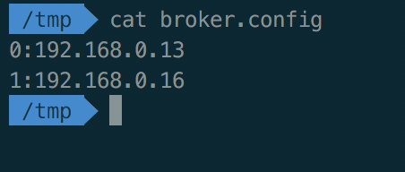
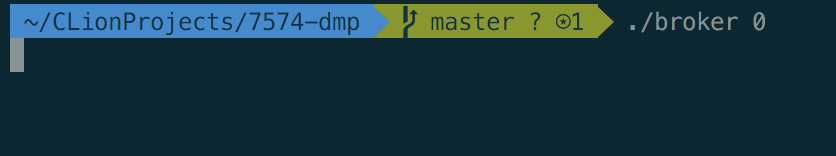
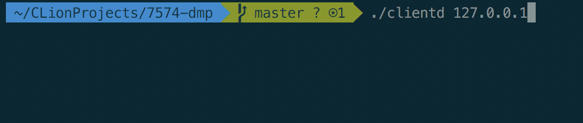
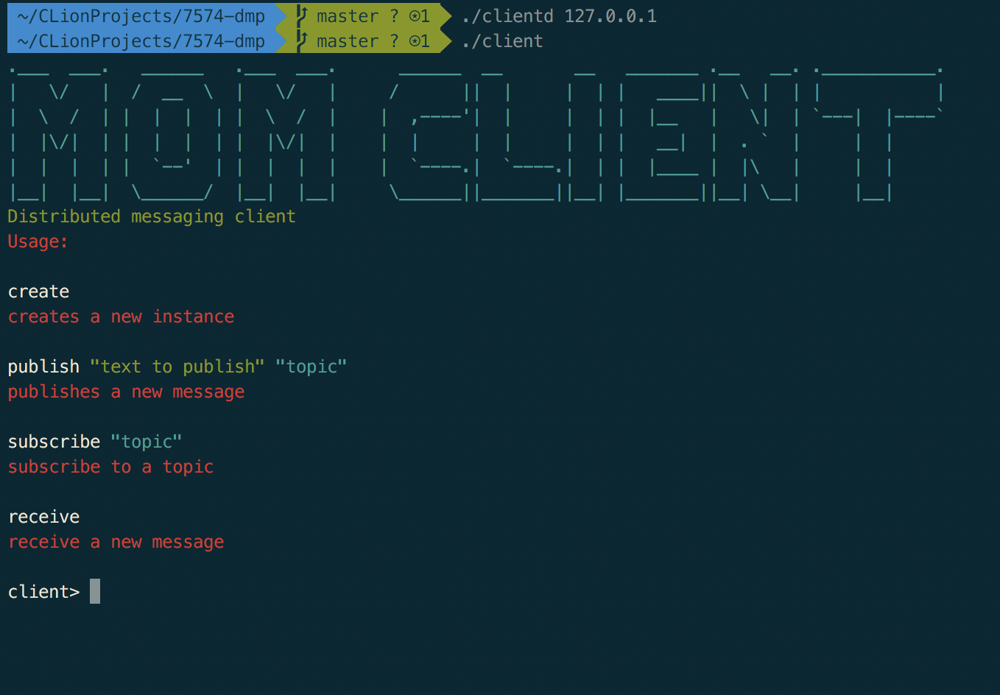
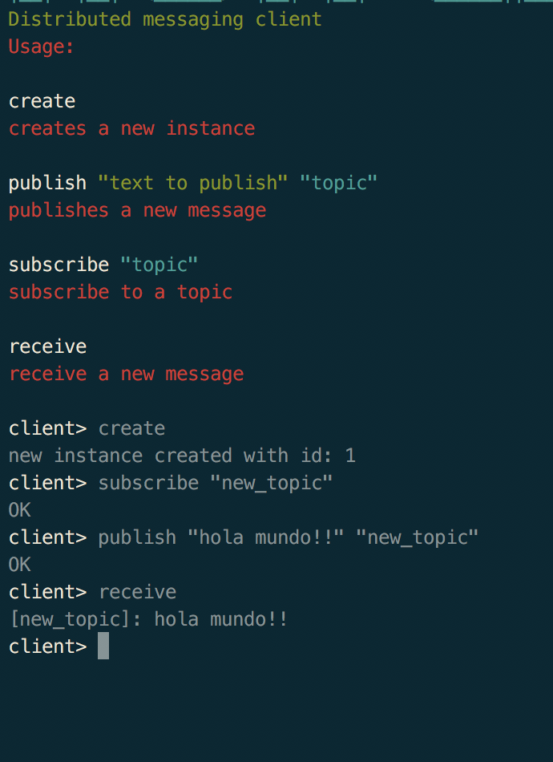

# 7574-dmp
distributed messaging platform

## Build
Este proyecto usa Cmake para el proceso de compilación. Ejecutar:

```
$ cmake .
$ make
```

## Brokers distribuidos
Para la segunda parte de este trabajo práctico se exige que se distribuya el trabajo del brokers en varias instancias.
Para lograr esto se necesita un archivo de configuración donde se indica que dirección ip corresponde a cada broker (/tmp/broker.config):

```
0:192.168.0.13
1:192.168.0.16
.
.
.

N:192.168.12.15
```


## Uso
Primero es necesario levantar una instancia de algún broker:
```
./broker {broker_id}
```


Donde `{broker_id}` se corresponde al id definido para ese broker en el archivo `/tmp/broker.config`.
Luego es necesario levantar el proceso daemon del cliente:
```
./clientd {broker_ip}
```
Donde `{broker_ip}` se corresponde a la ip donde esta el broker funcionando.



Por último, tenemos que crear una nueva instancia del cliente que hará uso del broker:
```
./client
```


En la misma ejecución puede verse una breve introducción de cómo ejecutar el cliente:



## Logs
Los logs pueden verse en el archivo '/tmp/dist_2017.log'.

```
$ tail -f /tmp/dist_2017.log
```


